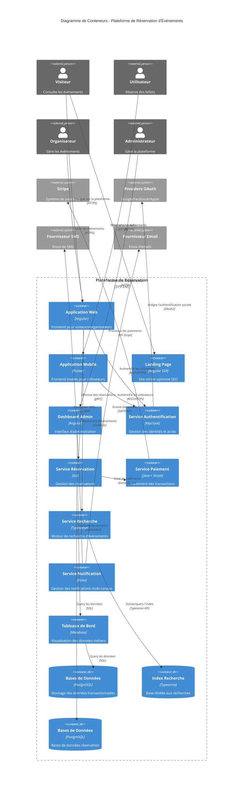

```mermaid
---
title: Diagramme de Conteneurs - Plateforme de Réservation d'Événements
---
C4Container
    title Diagramme de Conteneurs - Plateforme de Réservation d'Événements

    Person_Ext(visiteur, "Visiteur", "Consulte les événements")
    Person_Ext(utilisateur, "Utilisateur", "Réserve des billets")
    Person_Ext(organisateur, "Organisateur", "Gère les événements")
    Person_Ext(admin, "Administrateur", "Gère la plateforme")

    System_Boundary(system, "Plateforme de Réservation") {
        Container(web_app, "Application Web", "Angular", "Frontend pour visiteurs/organisateurs")
        Container(mobile_app, "Application Mobile", "Flutter", "Frontend mobile pour utilisateurs")
        Container(landing_page, "Landing Page", "Angular SSR", "Site vitrine optimisé SEO")
        Container(admin_dashboard, "Dashboard Admin", "Angular", "Interface d'administration")
        
        Container(auth_service, "Service Authentification", "Keycloak", "Gestion des identités et accès")
        Container(booking_service, "Service Réservation", "Go", "Gestion des réservations")
        Container(payment_service, "Service Paiement", "Java + Stripe", "Traitement des transactions")
        Container(search_service, "Service Recherche", "Typesense", "Moteur de recherche d'événements")
        Container(notif_service, "Service Notification", "Novu", "Gestion des notifications multi-canaux")
        
        Container(metabase, "Tableaux de Bord", "Metabase", "Visualisation des données métiers")
        
        ContainerDb(postgres, "Bases de Données", "PostgreSQL", "Stockage des données transactionnelles")
        ContainerDb(typesense_db, "Index Recherche", "Typesense", "Base dédiée aux recherches")
        ContainerDb(reservation_db, "Bases de Données", "PostgreSQL", "Bases de données réservation")
    }

    System_Ext(stripe, "Stripe", "Système de paiement")
    System_Ext(oauth, "Providers OAuth", "Google/Facebook/Apple")
    System_Ext(sms_provider, "Fournisseur SMS", "Envoi de SMS")
    System_Ext(email_provider, "Fournisseur Email", "Envoi d'emails")

    Rel(visiteur, landing_page, "Consulte les événements", "HTTPS")
    Rel(visiteur, web_app, "Navigue sur la plateforme", "HTTPS")
    Rel(utilisateur, mobile_app, "Réserve via mobile", "HTTPS")
    Rel(organisateur, web_app, "Gère ses événements", "HTTPS")
    Rel(admin, admin_dashboard, "Administre la plateforme", "HTTPS")

    Rel(web_app, auth_service, "Authentifie les utilisateurs", "REST/HTTPS")
    Rel(mobile_app, auth_service, "Authentifie les utilisateurs", "REST/HTTPS")
    Rel(web_app, booking_service, "Effectue des réservations", "gRPC")
    Rel(booking_service, payment_service, "Initie les paiements", "Event-Driven")
    Rel(payment_service, stripe, "Processus les paiements", "API Stripe")
    Rel(auth_service, oauth, "Intègre l'authentification sociale", "OAuth2")

    Rel(web_app, search_service, "Recherche d'événements", "GraphQL")
    Rel(search_service, typesense_db, "Stocke/query l'index", "Typesense API")
    Rel(booking_service, reservation_db, "Query les données", "SQL")
    Rel(notif_service, sms_provider, "Envoie des SMS", "API SMS")
    Rel(notif_service, email_provider, "Envoie des emails", "SMTP/API")

    Rel(admin_dashboard, metabase, "Consulte les analytics", "Embedded")
    Rel(metabase, postgres, "Query les données", "SQL")

    UpdateLayoutConfig($c4ShapeInRow="4", $c4BoundaryInRow="1")
```
