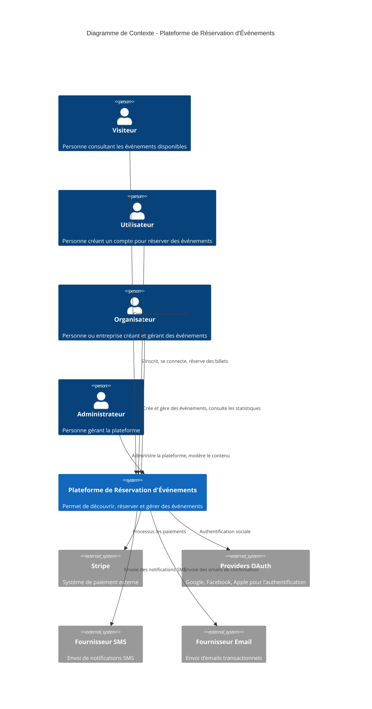

```mermaid
---
title: Diagramme de Contexte - Plateforme de Réservation d'Événements
---
C4Context
    title Diagramme de Contexte - Plateforme de Réservation d'Événements

    Person(visiteur, "Visiteur", "Personne consultant les événements disponibles")
    Person(utilisateur, "Utilisateur", "Personne créant un compte pour réserver des événements")
    Person(organisateur, "Organisateur", "Personne ou entreprise créant et gérant des événements")
    Person(admin, "Administrateur", "Personne gérant la plateforme")

    System(system, "Plateforme de Réservation d'Événements", "Permet de découvrir, réserver et gérer des événements")

    Rel(visiteur, system, "Consulte les événements")
    Rel(utilisateur, system, "S'inscrit, se connecte, réserve des billets")
    Rel(organisateur, system, "Crée et gère des événements, consulte les statistiques")
    Rel(admin, system, "Administre la plateforme, modère le contenu")

    System_Ext(stripe, "Stripe", "Système de paiement externe")
    System_Ext(oauth, "Providers OAuth", "Google, Facebook, Apple pour l'authentification")
    System_Ext(sms, "Fournisseur SMS", "Envoi de notifications SMS")
    System_Ext(email, "Fournisseur Email", "Envoi d'emails transactionnels")

    Rel(system, stripe, "Processus les paiements")
    Rel(system, oauth, "Authentification sociale")
    Rel(system, sms, "Envoie des notifications SMS")
    Rel(system, email, "Envoie des emails de confirmation")

    UpdateLayoutConfig($c4ShapeInRow="3", $c4BoundaryInRow="3")
```