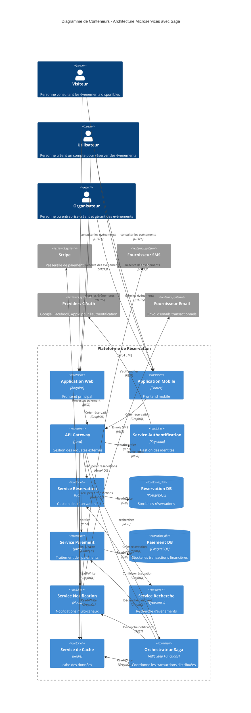

```mermaid
---
title: Diagramme de Conteneurs Révisé - Plateforme de Réservation
---
C4Container
    title Diagramme de Conteneurs - Architecture Microservices avec Saga

    Person(visiteur, "Visiteur", "Personne consultant les événements disponibles")
    Person(utilisateur, "Utilisateur", "Personne créant un compte pour réserver des événements")
    Person(organisateur, "Organisateur", "Personne ou entreprise créant et gérant des événements")


    System_Boundary(system, "Plateforme de Réservation") {
        Container(web_app, "Application Web", "Angular", "Frontend principal")
        Container(mobile_app, "Application Mobile", "Flutter", "Frontend mobile")

        Container(api_gateway, "API Gateway", "Java", "Gestion des requêtes externes")
        Container(auth_service, "Service Authentification", "Keycloak", "Gestion des identités")
        
        Container(booking_service, "Service Réservation", "Go", "Gestion des réservations")
        ContainerDb(booking_db, "Réservation DB", "PostgreSQL", "Stocke les réservations")
        
        Container(payment_service, "Service Paiement", "Java", "Traitement des paiements")
        ContainerDb(payment_db, "Paiement DB", "PostgreSQL", "Stocke les transactions financières")
        
        Container(notif_service, "Service Notification", "Novu", "Notifications multi-canaux")
        
        Container(search_service, "Service Recherche", "Typesense", "Recherche d'événements")
        
        Container(cache_service, "Service de Cache", "Redis", "cahe des données")
        
        Container(saga_orchestrator, "Orchestrateur Saga", "AWS Step Functions", "Coordonne les transactions distribuées")
    }

    System_Ext(stripe, "Stripe", "Passerelle de paiement")
    System_Ext(sms, "Fournisseur SMS", "Twilio")
    System_Ext(oauth, "Providers OAuth", "Google, Facebook, Apple pour l'authentification")
    System_Ext(email, "Fournisseur Email", "Envoi d'emails transactionnels")

    Rel(visiteur, web_app, "consulter les événements", "HTTPS")
    Rel(utilisateur, web_app, "Réserve des événements", "HTTPS")
    Rel(organisateur, web_app, "Gère les événements", "HTTPS")
    
    Rel(visiteur, mobile_app, "consulter les événements", "HTTPS")
    Rel(utilisateur, mobile_app, "Réserve des événements", "HTTPS")
    Rel(organisateur, mobile_app, "Gère les événements", "HTTPS")

    Rel(web_app, api_gateway, "Créer réservation", "GraphQL")
    Rel(mobile_app, api_gateway, "Créer réservation", "GraphQL")

    Rel(api_gateway, saga_orchestrator, "Créer réservation", "GraphQL")
    Rel(api_gateway, booking_service, "récupérer réservations", "GraphQL")
    Rel(api_gateway, payment_service, "récupérer transactions", "GraphQL")
    Rel(api_gateway, notif_service, "notifier", "REST")
    Rel(api_gateway, auth_service, "s'authentifier", "REST")
    Rel(api_gateway, search_service, "rechercher", "REST")
    Rel(api_gateway, cache_service, "Read/Write", "GraphQL")

    Rel(auth_service, oauth, "s'authentifier", "REST")
    
    Rel(saga_orchestrator, payment_service, "Déclenche paiement", "GraphQL")
    Rel(saga_orchestrator, cache_service, "Read/Write", "GraphQL")
    Rel(payment_service, stripe, "Processus paiement", "REST")
    
    Rel(saga_orchestrator, notif_service, "Déclenche notification", "REST")
    Rel(notif_service, sms, "Envoie SMS", "REST")
    Rel(notif_service, email, "Envoie Email", "REST")
    
    Rel(saga_orchestrator, booking_service, "Confirme réservation", "GraphQL")
    
    Rel(booking_service, booking_db, "Read/Write", "SQL")
    Rel(payment_service, payment_db, "Read/Write", "SQL")
    
    Rel(booking_service, cache_service, "Read/Write", "GraphQL")
    Rel(payment_service, cache_service, "Read/Write", "GraphQL")

    UpdateLayoutConfig($c4ShapeInRow="3", $c4BoundaryInRow="1")
```
